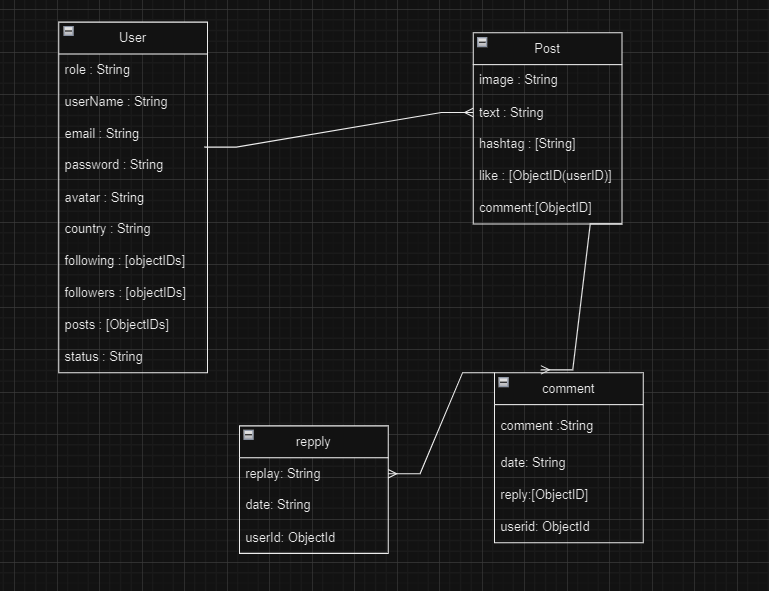
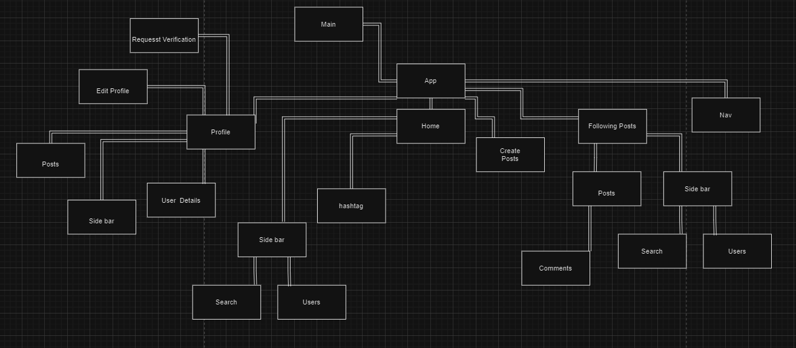

# LinkHub Project 

Welcome to the LinkHub project! LinkHub allows users to share pictures of their favorite places and connect with other travelers. Focusing on their travel experiences, along with comments and reviews. 

## Overview

LinkHub consists of two main repositories:
- Frontend: [Link to Frontend Repository](https://github.com/fsky99/LinkHub_Frontend/tree/main)
- Backend: [Link to Backend Repository](https://github.com/fsky99/LinkHub_Backend/tree/main)

## Project Description
Our website enables users to post pictures specifically highlighting their travel experiences. Users can provide reviews of the places they have visited and engage in discussions through comments. Users can share their perspectives and connect with others who share similar interests in travel.

## ERD

## CHD

